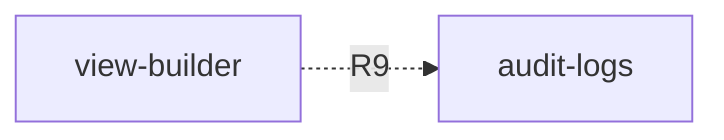

# Mermaid Monkey Superset DSL

## Goal

Mermaid Monkey should treat Mermaid as a language workspace, not only as source text for a renderer. The superset DSL must keep every diagram valid in native Mermaid while giving Mermaid Monkey enough structure to index symbols, link files, score lenses, and drive architecture-review UX.

## Core Rule

Use existing Mermaid syntax first. Add only comment directives for information Mermaid cannot express.

Native Mermaid owns:

- diagram family and direction: `flowchart LR`, `graph TD`
- node ids and labels: `view_builder[view-builder]`
- edge topology and labels: `A -->|R9| B`
- subgraphs and local direction
- classes and styles: `:::risk`, `classDef risk ...`
- line emphasis: `linkStyle`
- ordinary comments

Mermaid Monkey owns comment directives:

- cross-file links
- semantic identity
- file metadata
- edge metadata that should not crowd labels
- lens tags and future lens rules

## Compatibility Contract

All extensions are Mermaid comments:



Native Mermaid ignores those lines. Mermaid Monkey extracts them before Mermaid parsing and attaches them back to parsed graph symbols.

## Directive Grammar

The first slice supports these directives:

```text
%% @link <nodeId> -> <path>[#<nodeId>]
%% @entity <nodeId> <kind>:<canonicalId> [key=value ...]
%% @edge <sourceId> -> <targetId> [key=value ...]
%% @file [key=value ...]
%% @lens <name> [key=value ...]
```

Values are intentionally simple:

- unquoted token: `severity=critical`
- quoted token: `title="Product topology"`
- comma list: `tags=transform,risk`
- bare flag: `critical`

Unknown keys are preserved as metadata. The renderer and index can decide later which keys matter.

## First Implementation Slice

The first implemented slice is language/indexing, not visual UX:

1. Parse `@entity`, `@edge`, `@file`, and `@lens` directives.
2. Preserve native Mermaid compatibility by stripping those directives before Mermaid parsing.
3. Attach `@entity` metadata to matching `RenderNode.metadata`.
4. Attach `@edge` metadata to matching `RenderEdge.metadata`.
5. Build a project index from a map of Mermaid files:
   - file list
   - node occurrences
   - semantic entities
   - edge occurrences
   - cross-file links
   - warnings from malformed or dangling semantic directives

## Lens Algorithm Target

Lenses are deterministic scoring functions over indexed symbols:

```text
score(symbol, lens) -> 0..1
```

Examples:

- Risk MRI: status `unpinned`, severity, seam refs, and nodes touching open seams.
- Rails MRI: wildcard rails, rail tags, and nodes linked to identity/events/llm/otel/surface.
- Runtime MRI: event, API, LLM, OTEL, CLI/MCP, service metadata.
- Governance MRI: authz, tenant-isolation, audit, billing, infra, observability.
- Data-flow MRI: source -> transform -> semantics -> chat -> blocks/proactive.

The first slice does not render lenses; it creates the semantic graph needed to implement them cleanly.

## Planning Axes For Next Goal

- Compatibility surface: standard Mermaid syntax vs Mermaid Monkey comments.
- Semantic target: file, node, edge, subgraph, class, project.
- Metadata type: identity, tag, relationship, risk, runtime, ownership, lens.
- Index behavior: per-file parse, cross-file symbol merge, duplicate detection, backlink extraction.
- UX consumer: navigation, search, MRI lenses, warnings, doc opening, export.
- Trust boundary: virtual resolver, allowlisted files, no raw author URL fetch.
- Test level: parser unit, graph-builder unit, project-index unit, browser interaction.
- Degradation: malformed directives, missing nodes, missing files, unsupported diagram types.
